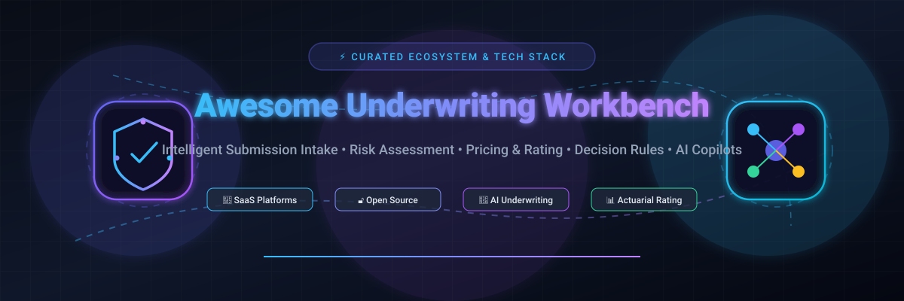
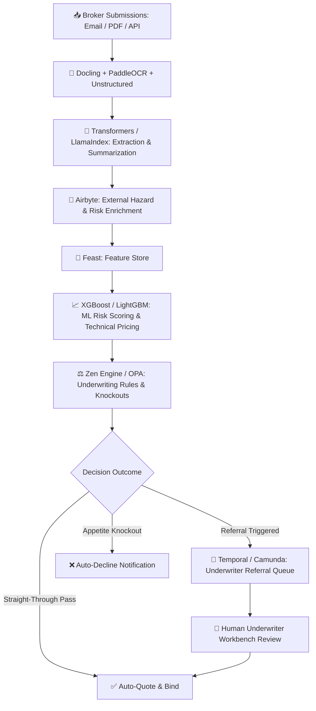

<p align="center">
  
</p>

# ⚡ Awesome Underwriting Workbench 🏢 🛡️

<p align="center">
  <a href="https://github.com/ishandutta2007/Awesome-Awesome-Awesome"></a>
  <a href="https://discord.gg/jc4xtF58Ve"></a>
  <a href="https://github.com/ishandutta2007/Awesome-Underwriting-Workbench/stargazers"></a>
  <a href="https://github.com/ishandutta2007/Awesome-Underwriting-Workbench/network/members"></a>
  <a href="https://github.com/ishandutta2007/Awesome-Underwriting-Workbench/blob/main/LICENSE"></a>
  <a href="https://github.com/ishandutta2007/Awesome-Underwriting-Workbench/pulls"></a>
  <a href="https://github.com/ishandutta2007"></a>
</p>

---

## 🌟 Top Underwriting Workbench Ecosystem

> **Curated Directory of Commercial SaaS/Hosted Platforms & Open-Source Projects for Insurance Underwriting Workbenches, Submission Management, Risk Assessment, Rating & Pricing, Rules Automation, and AI Copilots.**  
> 📅 **Last updated: August 2026**

This repository tracks premier **SaaS/Hosted Platforms** and **open-source frameworks** designed for modern **Insurance Underwriting Workbenches**. These solutions empower insurance carriers, MGAs, Lloyd's syndicates, brokers, and reinsurers to automate submission intake, extract data from unstructured documents, enrich risk profiles, execute complex decision rules, compute actuarial pricing, streamline referral escalations, generate quotes, and deliver straight-through processing from intake to bind.

---

## 📑 Table of Contents

- [🏢 SaaS / Hosted Platforms](#-saashosted-platforms)
- [🔓 Open-Source GitHub Projects](#-open-source-github-projects)
- [🛠️ Recommended Open-Source Stacks](#️-recommended-open-source-stacks)
- [🧱 Underwriting Workbench Building Blocks](#-underwriting-workbench-building-blocks)
- [💡 Key Underwriting Concepts & Glossary](#-key-underwriting-concepts--glossary)
- [📈 Star History](#-star-history)
- [🤝 How to Contribute](#-how-to-contribute)
- [📜 Disclaimer](#-disclaimer)

---

## 🏢 SaaS/Hosted Platforms

The commercial underwriting workbench landscape is led by enterprise core insurance suites and modern AI-native orchestration platforms. The table below compares leading platforms, ordered by company scale and market footprint.

| Platform | Company Scale / Valuation | Description | Pricing (Starting Tier) | Free Tier Limits / Trial |
| :--- | :--- | :--- | :--- | :--- |
| **[Guidewire](https://www.guidewire.com/)** | ~$18.5B Market Cap (~$1.05B+ Annual Revenue) | Market-leading P&C insurance core suite featuring PolicyCenter, HazardHub, ClaimCenter, and cloud underwriting rules orchestration. | Starts at ~$50,000/year (Base entry licensing tier for cloud modules, scaling to $150k+/year for enterprise suites) | No free forever tier; 0-day self-serve trial (vendor-led POC and sandbox demonstration upon enterprise qualification) |
| **[Duck Creek](https://www.duckcreek.com/)** | ~$2.6B Valuation (~$350M+ Annual Revenue) | Comprehensive cloud P&C platform encompassing policy administration, rating, billing, claims, and Send Technology underwriting orchestration. | Starts at ~$40,000/year (Duck Creek OnDemand starting subscription based on Direct Written Premium & active modules) | No free forever tier; 0-day self-serve trial (custom enterprise demonstration and POC upon sales consultation) |
| **[Sapiens](https://sapiens.com/)** | ~$1.85B Market Cap (~$525M+ Annual Revenue) | Global core software vendor delivering CoreSuite, Sapiens Decision (DMN decision management), and automated underwriting across P&C and L&P. | Starts at ~$54,000/year (CoreSuite & Sapiens Decision starting base tier for underwriting & policy management) | No free forever tier; 0-day self-serve trial (interactive proof-of-concept and guided demo on request) |
| **[EIS](https://www.eisgroup.com/)** | ~$1.5B Valuation (~$120M+ Annual Revenue) | Cloud-native, API-first digital core platform (CloudCore) supporting agile underwriting, product modeling, rating, and omnichannel distribution. | Starts at ~$50,000/year (CloudCore SaaS subscription structured around active policies in force & lines of business) | No free forever tier; 0-day self-serve trial (structured discovery demo and enterprise POC upon request) |
| **[Insurity](https://www.insurity.com/)** | ~$1.3B Valuation (~$180M+ Annual Revenue) | Cloud-based P&C software platform specializing in automated underwriting, policy administration, geospatial risk analytics, and billing. | Starts at ~$30,000/year (or ~$2,500/month baseline for mid-market cloud underwriting & policy tier) | No free forever tier; 0-day self-serve trial (guided evaluation demo and technical scoping assessment on request) |
| **[Majesco](https://www.majesco.com/)** | ~$750M Valuation (~$175M+ Annual Revenue) | Cloud insurance software provider offering Majesco Intelligent Underwriting, P&C Core Suite, loss control, and digital customer journeys. | Starts at ~$50,000/year (Majesco Cloud / Intelligent Underwriting baseline subscription) | No free forever tier; 0-day self-serve trial (guided walkthrough and custom evaluation environment upon request) |
| **[AKUR8](https://akur8.com/)** | ~$350M Valuation (~$40M+ Annual Revenue) | Transparent AI pricing and actuarial modeling platform that automates GLM creation and rate modeling with explainable machine learning. | Starts at ~$50,000/year (AWS Marketplace private offer / tiered subscription based on actuarial seats & model complexity) | No free forever tier; 0-day self-serve trial (guided pilot evaluation program offered via sales/AWS Private Offer) |
| **[INSTANDA](https://instanda.com/)** | ~$180M Valuation (~$25M+ Annual Revenue) | No-code cloud insurance product configuration and underwriting workbench platform designed for rapid product launch by insurers & MGAs. | Starts at ~$1,000/user/month (or ~£12,000/year base access fee + processing and build fees) | No free forever tier; 0-day self-serve trial (custom sandbox demonstration and POC environment on request) |
| **[Cytora](https://www.cytora.com/)** | ~$120M Valuation (~$20M+ Annual Revenue) | AI-powered digital risk processing platform that digitizes commercial submission intake, enriches risk data, and automates triage workflows. | Starts at ~$40,000/year (Google Cloud Marketplace private offer / annual subscription based on submission intake volume) | No free forever tier; 0-day self-serve trial (bespoke POC upon enterprise qualification; free access to Risk Flow Academy training) |
| **[Send Technology](https://send.technology/)** | ~$85M Valuation (~$12M+ Annual Revenue) | AI-native underwriting orchestration workbench for commercial, specialty, and London Market insurers/MGAs (acquired by Duck Creek Technologies). | Starts at ~$35,000/year (SaaS enterprise licensing based on Gross Written Premium and user volume) | No free forever tier; 0-day self-serve trial (custom pilot and demonstration available upon sales qualification) |

---

## 🔓 Open-Source GitHub Projects

Building an underwriting workbench using open-source components requires assembling best-of-breed tools across document extraction, workflow orchestration, rule engines, machine learning, feature stores, and actuarial libraries. The table below lists top open-source projects, sorted by star count (descending).

| Project / Repository | Stars Badge | Primary Capability | Description |
| :--- | :--- | :--- | :--- |
| **[Transformers](https://github.com/huggingface/transformers)** | [](https://github.com/huggingface/transformers/stargazers) | 🤖 Document AI / NLP | State-of-the-art NLP library powering submission summarization, loss run understanding, policy Q&A, and underwriter copilot assistants. |
| **[PaddleOCR](https://github.com/PaddlePaddle/PaddleOCR)** | [](https://github.com/PaddlePaddle/PaddleOCR/stargazers) | 📄 Document Intelligence | Ultra-lightweight OCR system for parsing scanned insurance ACORD forms, loss runs, schedules of values, and financial statements. |
| **[Docling](https://github.com/DS4SD/docling)** | [](https://github.com/DS4SD/docling/stargazers) | 📑 PDF & Layout Parsing | Advanced document processing tool that parses complex PDF layouts, tables, and nested structures in commercial submission packets. |
| **[LlamaIndex](https://github.com/run-llama/llama_index)** | [](https://github.com/run-llama/llama_index/stargazers) | 🧠 Underwriting RAG | Context augmentation and RAG framework for querying complex underwriting guidelines, insurance policies, and risk manuals. |
| **[Apache Kafka](https://github.com/apache/kafka)** | [](https://github.com/apache/kafka/stargazers) | ⚡ Event Streaming | Distributed event streaming backbone for real-time submission ingestion, webhook triggers, risk enrichment, and core PAS sync. |
| **[XGBoost](https://github.com/dmlc/xgboost)** | [](https://github.com/dmlc/xgboost/stargazers) | 📈 Risk & Pricing ML | Scalable gradient boosting library widely used by actuaries and data scientists for claim frequency/severity and technical pricing. |
| **[MLflow](https://github.com/mlflow/mlflow)** | [](https://github.com/mlflow/mlflow/stargazers) | 🔬 MLOps & Governance | End-to-end machine learning lifecycle management for tracking, deploying, and governing risk scoring models and pricing algorithms. |
| **[SHAP](https://github.com/shap/shap)** | [](https://github.com/shap/shap/stargazers) | 🔍 Explainable AI (XAI) | Game-theoretic model interpretability library to explain automated underwriting decisions, detect bias, and ensure regulatory compliance. |
| **[Temporal](https://github.com/temporalio/temporal)** | [](https://github.com/temporalio/temporal/stargazers) | 🔄 Workflow Orchestration | Resilient workflow engine for managing complex quote-to-bind sagas, underwriter referrals, authority approvals, and API sync. |
| **[Airbyte](https://github.com/airbytehq/airbyte)** | [](https://github.com/airbytehq/airbyte/stargazers) | 🔗 Data Integration | ELT data pipeline platform for synchronizing external hazard feeds, credit ratings, corporate registries, and geospatial risk data. |
| **[LightGBM](https://github.com/microsoft/LightGBM)** | [](https://github.com/microsoft/LightGBM/stargazers) | ⚡ Actuarial ML | Fast, distributed gradient boosting framework specialized in high-dimensional tabular insurance datasets and rating factors. |
| **[Unstructured](https://github.com/Unstructured-IO/unstructured)** | [](https://github.com/Unstructured-IO/unstructured/stargazers) | 🗂️ Document Ingestion | Ingestion engine transforming raw broker emails, policy PDFs, word documents, and attachments into clean structured text for LLMs. |
| **[OpenSearch](https://github.com/opensearch-project/OpenSearch)** | [](https://github.com/opensearch-project/OpenSearch/stargazers) | 🔎 Search & Vector DB | Scalable vector search and indexing engine for underwriter risk dossiers, submission deduplication, and policy search. |
| **[Open Policy Agent (OPA)](https://github.com/open-policy-agent/opa)** | [](https://github.com/open-policy-agent/opa/stargazers) | ⚖️ Declarative Rules | General-purpose policy engine using Rego to enforce underwriting appetite rules, authority delegation, and knockout criteria. |
| **[Great Expectations](https://github.com/great-expectations/great_expectations)** | [](https://github.com/great-expectations/great_expectations/stargazers) | 🛡️ Data Quality | Automated data validation framework to ensure insurance submission fields and third-party data inputs conform to expected standards. |
| **[Cleanlab](https://github.com/cleanlab/cleanlab)** | [](https://github.com/cleanlab/cleanlab/stargazers) | 🧹 Data-Centric AI | Tool for detecting data errors, outlier risks, and labeling anomalies in historical claims and underwriting training data. |
| **[sktime](https://github.com/sktime/sktime)** | [](https://github.com/sktime/sktime/stargazers) | ⏱️ Time Series Analytics | Machine learning time series library for forecasting loss development trends, seasonal claim patterns, and macro inflation exposure. |
| **[PyMC](https://github.com/pymc-devs/pymc)** | [](https://github.com/pymc-devs/pymc/stargazers) | 🎲 Bayesian Modeling | Probabilistic programming language for Bayesian actuarial modeling, extreme value loss estimation, and catastrophic tail risk. |
| **[Evidently](https://github.com/evidentlyai/evidently)** | [](https://github.com/evidentlyai/evidently/stargazers) | 📊 Model Monitoring | Open-source ML and LLM evaluation tool for tracking underwriting model drift, data distribution changes, and scoring accuracy. |
| **[Feast](https://github.com/feast-dev/feast)** | [](https://github.com/feast-dev/feast/stargazers) | 🍱 Feature Store | Enterprise feature store managing real-time and batch risk variables (credit score, loss history, weather indices) for underwriting models. |
| **[Camunda](https://github.com/camunda/camunda)** | [](https://github.com/camunda/camunda/stargazers) | 🔀 BPMN & DMN Engine | Complete business process management engine for complex multi-tier underwriter referral workflows and DMN decision tables. |
| **[Zen Engine (GoRules)](https://github.com/gorules/zen)** | [](https://github.com/gorules/zen/stargazers) | ⚡ Business Rules Engine | Blazing fast business rules engine in Go/Node/Python for executing underwriting decision tables, discounts, and eligibility checks. |
| **[chainladder-python](https://github.com/casact/chainladder-python)** | [](https://github.com/casact/chainladder-python/stargazers) | 📊 Actuarial Reserving | CAS-supported Python package for property & casualty actuarial reserving, triangle manipulation, and loss development calculations. |
| **[Drools](https://github.com/kiegroup/drools)** | [](https://github.com/kiegroup/drools/stargazers) | 📋 Enterprise BRMS | Battle-tested rule engine, DMN engine, and forward/backward-chaining inference engine for enterprise insurance decisioning. |

---

## 🛠️ Recommended Open-Source Stacks

Modern underwriting platforms combine multiple specialized open-source tools into cohesive architectural blueprints:



### 1. ⚙️ Basic Underwriting Rules & Eligibility Engine
* **Stack:** `Open Policy Agent (OPA)` + `PostgreSQL` + `React`
* **Use Case:** Validating submission eligibility, checking license states, verifying minimum attachment points, and enforcing authority thresholds.

### 2. 📑 Document-Heavy Commercial Submission Intake
* **Stack:** `Docling` + `Unstructured` + `PaddleOCR` + `OpenSearch` + `LlamaIndex`
* **Use Case:** Ingesting 50+ page commercial submission packages, loss runs, ACORD 125/126/130 forms, and statement of values (SOVs).

### 3. 🤖 AI-Native Underwriting Copilot Stack
* **Stack:** `Transformers` + `LlamaIndex` + `XGBoost` + `MLflow` + `SHAP` + `OPA`
* **Use Case:** Providing underwriters with automated risk summaries, guideline Q&A, ML risk scoring, and explainable reason codes for adverse actions.

### 4. 🏢 Event-Driven Enterprise Underwriting Workbench
* **Stack:** `Apache Kafka` + `Airbyte` + `Feast` + `Temporal` + `Zen Engine` + `OpenSearch`
* **Use Case:** Orchestrating multi-tier commercial underwriting referral lifecycles, streaming telemetry data, and syncing with policy administration systems (PAS).

### 5. 📊 Actuarial Pricing & Loss Reserving Suite
* **Stack:** `Python` + `chainladder-python` + `PyMC` + `XGBoost` + `LightGBM`
* **Use Case:** Fitting generalized linear models (GLMs), building price optimization curves, and tracking burning cost / loss development.

---

## 🧱 Underwriting Workbench Building Blocks

A production-grade Underwriting Workbench consists of nine core functional pillars:

```
┌─────────────────────────────────────────────────────────────────────────┐
│                      UNDERWRITER WORKBENCH (UI / UX)                    │
├───────────────────┬───────────────────┬─────────────────────────────────┤
│ 📥 SUBMISSION     │ 📄 DOCUMENT       │ 🔍 RISK ASSESSMENT              │
│    MANAGEMENT     │    INTELLIGENCE   │    & ENRICHMENT                 │
│ • Multi-channel   │ • Layout parsing  │ • Geospatial hazards            │
│ • Deduplication   │ • Loss runs OCR   │ • Property data (HazardHub)     │
│ • Completeness    │ • SOV table parse │ • Credit & financial health     │
├───────────────────┼───────────────────┼─────────────────────────────────┤
│ ⚖️ UNDERWRITING   │ 💰 RATING &       │ 🔄 WORKFLOW &                   │
│    RULES ENGINE   │    PRICING        │    REFERRALS                    │
│ • Appetite checks │ • Rate tables     │ • Four-eyes approval            │
│ • Authority limit │ • Loss cost / GLM │ • Broker communication          │
│ • Knockout logic  │ • Loadings/Debits │ • Audit trail & versioning      │
├───────────────────┼───────────────────┼─────────────────────────────────┤
│ 🤖 GENERATIVE AI  │ 📊 PORTFOLIO &    │ 🏛️ GOVERNANCE &                 │
│    & COPILOTS     │    ACCUMULATION   │    COMPLIANCE                   │
│ • Risk summaries  │ • Cat modeling    │ • Decision lineage              │
│ • Guideline Q&A   │ • Line capacity   │ • Model risk management         │
│ • AI triage agent │ • Loss ratio drill│ • Bias & fairness detection     │
└───────────────────┴───────────────────┴─────────────────────────────────┘
```

---

## 💡 Key Underwriting Concepts & Glossary

- **Underwriting Workbench:** An integrated operational interface that aggregates submission intake, risk scoring, data enrichment, rating engines, and workflow controls into a single cockpit for commercial underwriters.
- **Straight-Through Processing (STP):** Automated evaluation and binding of policies meeting strict appetite and risk thresholds without requiring human underwriter intervention.
- **Submission-to-Bind Ratio:** Key commercial insurance metric tracking the percentage of received broker submissions that convert into bound policies.
- **Statement of Values (SOV):** A detailed schedule listing all insured property locations, construction classes, protection features, and individual replacement values.
- **Loss Runs:** Historical report detailing past insurance claims, incurred losses, paid amounts, and open reserves associated with a commercial applicant.
- **Technical Pricing vs. Commercial Pricing:** Technical pricing reflects pure risk-adjusted loss cost and expenses; commercial pricing adjusts for market conditions, broker relationships, and competitive dynamics.
- **Rules as Code (RaC):** Defining underwriting guidelines, acceptance rules, and referral limits as declarative, version-controlled code artifacts rather than static PDF manuals.
- **Explainable AI (XAI):** Mathematical techniques (such as SHAP values) that provide transparent, human-understandable justifications for AI underwriting recommendations.

---

## 📈 Star History

[](https://star-history.dera.page/#ishandutta2007/Awesome-Underwriting-Workbench&type=date&legend=top-left)

---

## 🤝 How to Contribute

Contributions are welcome! To contribute to this curated repository:

1. 🍴 Fork the repository.
2. 📝 Add or edit entries in `README.md` (maintain standard table and badge formatting).
3. 🔎 Verify that open-source additions include valid GitHub links, accurate descriptions, and active maintenance status.
4. 🚀 Submit a Pull Request describing your changes.

---

## 📜 Disclaimer

*This repository is a community-curated directory intended for educational and research purposes. Commercial platform capabilities, valuations, pricing estimates, and features are subject to change by respective vendors. Always verify specifications, licenses, and compliance requirements directly with the vendor or repository maintainers prior to enterprise procurement.*
